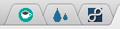

It's been a month since I first use [coffitivity](http://coffitivity.com), and got to see the changes of the site along the way. I meant to tweet to share the setup I've been doing along that can boost the **"cafe"** feeling, but I think its too long to fit in on 40 characters.

Usually I've got 3 tabs pinned to the left side of browser:

You can see it right there, Coffitivity + [Rainymood](http://www.rainymood.com) + an 8tracks music. I opened those at night times, especially these hot summer days here in the Philippines. Obviously on daytime, it wouldn't cut the mood, hearing the rain when its actually sunny outside the window and the heat coming through the room.

The volumes are set as much as possible close in real life environment:

* Coffitivity = 70%
* Rainymood = 10%
* 8tracks = 20%

Coffitivity is set higher than everything else since, the noise is the closest to you when you are in a real cafe: the mutterings, are just inches from your table, the clacks and clinks, and everything else revolves around. Second highest is the 8tracks music I have: you can ask yourself, which is closer to your ears, the people around you or the background music? Then, lastly, the drips of the rain outside the cafe window. 

Though it all boils down to your own preferences. What I have here is sharing what works for me.

Probably someone will wonder and ask, what music do I play from the 8tracks site? I've found the perfect playlist for my taste, and for my cafe virtual environment: [the Jazzy Bossa Nova](http://8tracks.com/avantcrap/jazzy-bossa-nova).

Now we have those "cold rainy nights in a cafe drinking coffe and working with utmost productivity". :-)